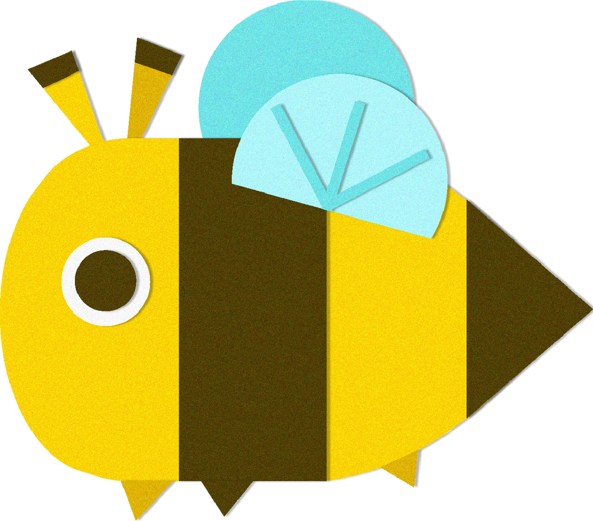

# BrightBee

**BrightBee** is an engaging, gamified study‐timer app for iOS, built with React Native and Expo Router. It helps students track Pomodoro‐style study sessions, visualize weekly progress, and personalize their experience with themes, presets, and custom durations.

---

## 🚀 Features

- **Home Dashboard**  
  – Greeting with user’s name & date  
  – “Start Studying →” button  
  – Circular stat “bubbles” for today’s & weekly study time, favorite subject, best month

- **Study Timer**  
  – Pomodoro presets (15 min, 30 min, 1 hr, 2 hr)  
  – Custom timer input  
  – Start / Pause / Reset controls  
  – “Finish Session” logs elapsed time to weekly summary

- **Weekly Overview**  
  – Bar chart / progress bars from Monday–Sunday  
  – Live update whenever a session completes

- **Profile & Settings**  
  – Editable username stored in app context  
  – Notifications toggle  
  – Quick‐access menu: Wallet, Edit Profile, Task Center, Activities, Logout

- **Theme & Styling**  
  – Soft yellow → white gradient backgrounds  
  – Clean black/yellow/white palette  
  – Friendly bee‐mascot iconography

---

## 📦 Tech Stack

- **React Native** (0.76.x)  
- **Expo SDK** (50.x) & **expo-router** for file‐based routing  
- **React Context** for global state (username, study data)  
- **@expo/vector‑icons** (Ionicons) for tab bar icons  
- **expo-linear-gradient** for backgrounds  

---

## 🗂️ Project Structure

